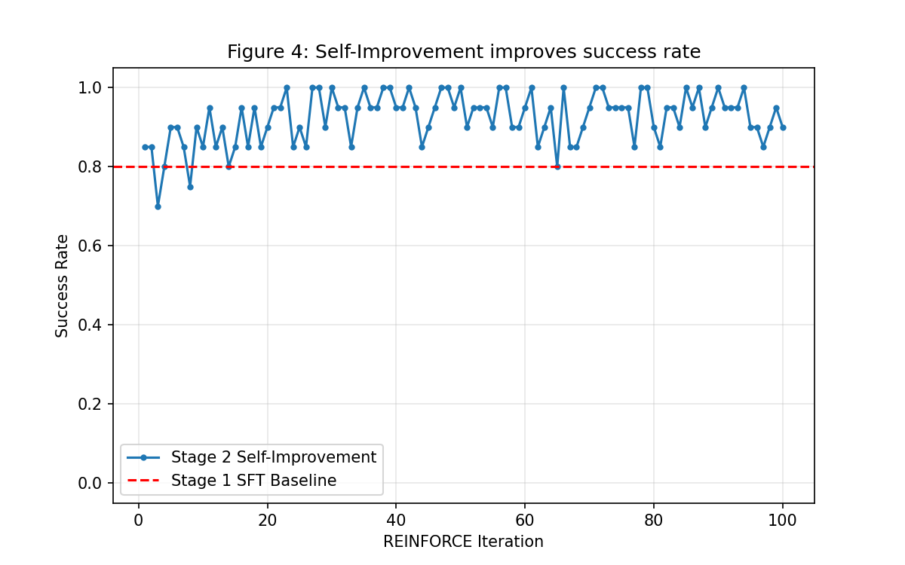

# Self-Improving Exploration Foundation Models (PyTorch Reproduction)

A PyTorch reproduction of the core experiments from [**"Self-Improving Exploration Foundation Models"**](https://self-improving-efms.github.io/), specifically reproducing **Figure 4** — demonstrating that self-improvement via reinforcement learning can surpass supervised fine-tuning (SFT) performance.

## Project Overview

This project implements a two-stage training pipeline for a point-mass navigation task:

- **Stage 1 (SFT):** Train a policy network and a steps-prediction network via supervised learning on expert demonstrations collected from a PD controller.
- **Stage 2 (RL):** Fine-tune the policy using REINFORCE with intrinsic rewards derived from the steps-prediction network (StepsNet), enabling self-improvement beyond the SFT baseline.

### Key Result

| Metric | Stage 1 (SFT) | Stage 2 (RL) |
|---|---|---|
| Success Rate | 0.84 | **0.92 ~ 0.98** |
| Avg Episode Length | 47.7 | **31.2 ~ 37.9** |



## Project Structure

```
pytorch/
├── env/
│   └── point_mass.py          # 2D point-mass environment (dm_env interface)
├── models/
│   ├── policy_net.py           # Gaussian policy network
│   └── steps_net.py            # Steps-to-goal prediction network
├── utils/
│   └── reinforce.py            # REINFORCE algorithm + intrinsic rewards
├── train_sft.py                # Stage 1: Expert data collection + SFT training
├── train_rl.py                 # Stage 2: Self-improvement via RL
├── .env                        # Hyperparameter configuration file
├── figure4_reproduced.png      # Output figure
├── runs/                       # TensorBoard log directory (auto-generated)
│   ├── sft_training/           #   Stage 1 training metrics
│   └── rl_training/            #   Stage 2 training metrics
└── README.md
```

## Installation

### Prerequisites

- Python 3.8+
- PyTorch 1.12+
- NumPy
- Matplotlib
- dm-env
- TensorBoard
- python-dotenv

### Setup

```bash
# Create a conda environment (recommended)
conda create -n efm_py python=3.10
conda activate efm_py

# Install dependencies
pip install torch numpy matplotlib dm-env tensorboard python-dotenv
```

## Configuration via `.env`

All key hyperparameters can be configured through a `.env` file in the `pytorch/` directory, eliminating the need to modify source code when tuning experiments.

**Example `.env` file:**

```env
# Environment
ACTION_SCALE=0.001
DEVICE=cpu
MAX_STEPS=200

# Stage 1 (SFT)
NUM_EXPERT_EPISODES=1000
SFT_EPOCHS=50
SFT_LR=3e-4
SFT_BATCH_SIZE=256
SFT_EVAL_EPISODES=200

# Stage 2 (RL)
RL_ITERATIONS=100
RL_EPISODES_PER_ITER=20
RL_LR=1e-4
RL_GAMMA=0.99
RL_EVAL_EPISODES=50
```

> **💡 Why `DEVICE=cpu`?**
> This project uses very lightweight networks (2-layer MLP, dim=256) with a 6-dim input space.
> At this scale, CPU is actually **faster** than GPU — the overhead of CPU↔GPU data transfer
> on every step far outweighs the minimal compute benefit. This is especially true during
> the RL stage, where the environment runs on CPU and each step requires a round-trip
> (`CPU → GPU → inference → GPU → CPU → env.step()`).
> Setting `DEVICE=cuda` is supported but not recommended for this project.

If the `.env` file is not present, all parameters fall back to sensible default values defined in the source code.

## How to Run

### Stage 1: Supervised Fine-Tuning (SFT)

```bash
python train_sft.py
```

This will:
1. Collect 1000 episodes of expert demonstrations using the built-in PD controller
2. Train `PolicyNet` and `StepsNet` via supervised learning for 50 epochs
3. Evaluate the SFT policy and print the success rate
4. Save model weights: `policy_sft.pth`, `steps_net_sft.pth`

**Expected output:**
```
Expert success rate: 1.00 (1000/1000)
Collected ~12000 samples, scaled action range: [-0.378, 0.368]
...
SFT Eval - Success Rate: ~0.80+, Avg Length: ~50
```

### Stage 2: Self-Improvement via REINFORCE

```bash
python train_rl.py
```

This will:
1. Load the SFT-pretrained models from Stage 1
2. Run 100 iterations of REINFORCE with intrinsic rewards from StepsNet
3. Evaluate and print success rates every 10 iterations
4. Generate and save `figure4_reproduced.png`
5. Save final models: `policy_rl.pth`, `steps_net_rl.pth`

**Expected output:**
```
Stage 1 Policy - Success Rate: 0.84
...
Iter 60/100, Eval SR: 0.94, Eval Len: 33.4
...
Iter 90/100, Eval SR: 0.98, Eval Len: 31.2
```

## TensorBoard Monitoring

Training metrics for both stages are automatically logged to TensorBoard. After running training, launch TensorBoard with:

```bash
tensorboard --logdir=runs --port=6007
```

Then open **http://localhost:6007** in your browser.

### Available Metrics

| Panel | Metric | Description |
|---|---|---|
| `sft/policy_loss` | Policy negative log-likelihood | Should decrease over epochs |
| `sft/steps_loss` | StepsNet cross-entropy loss | Should decrease over epochs |
| `sft/total_loss` | Combined loss | Overall SFT training progress |
| `sft/learning_rate` | Cosine-annealed LR | Tracks scheduler state |
| `train/policy_loss` | REINFORCE policy gradient loss | Per-iteration RL loss |
| `train/success_rate` | Training rollout success rate | Per-iteration success rate |
| `train/avg_episode_length` | Mean episode length | Should decrease as policy improves |
| `train/avg_intrinsic_reward` | Mean intrinsic reward from StepsNet | Indicates learning progress |
| `eval/success_rate` | Evaluation success rate (every 10 iters) | More stable metric (50 episodes) |
| `eval/avg_length` | Evaluation average episode length | Measures efficiency |
| `eval/length_std` | Evaluation episode length std | Measures consistency |

### Sample Dashboard

The TensorBoard dashboard displays real-time curves for both SFT and RL training runs side by side, enabling easy comparison of training dynamics across stages.

## Key Challenges & Solutions

Throughout the development and debugging process, several critical issues were identified and resolved. Below is a summary of the major problems encountered and how they were addressed.

### 1. Physics Simulation Instability — Action Scale Mismatch

**Problem:** The policy produced actions that immediately caused the agent to fly out of bounds, resulting in 0% success rate even with a seemingly reasonable PD expert controller.

**Root Cause:** The environment's `step()` function applies the action over **10 physics substeps** with a compounding effect:

```python
for i in range(self._physics_substeps):    # 10 iterations
    self._cur_vel += action                 # velocity accumulates 10× action
    self._cur_pos += self._cur_vel          # position accumulates 10× velocity
```

This means a single `step()` call adds `10 × action` to velocity and approximately `55 × action` to position (arithmetic series sum). The environment's built-in PD controller uses extremely small gains (`Kp = 0.0002`, `Kd = 0.0125`), producing actions on the order of `±0.0004`.

**Initial Mistake:** A custom PD controller was written with `Kp = 5.0`, which is **~25,000× too large**, causing immediate divergence.

**Solution:**
- Use the environment's built-in `pd_controller()` function for expert data collection
- Introduce an `ACTION_SCALE = 0.001` normalization factor so that the neural network operates in a numerically friendly range (`±0.4`) rather than the raw action range (`±0.0004`)
- Ensure the same `ACTION_SCALE` is applied consistently across SFT training, RL training, and evaluation

### 2. Neural Network Output Scale Mismatch

**Problem:** Even after using the correct PD controller, the SFT-trained policy achieved only ~5% success rate despite low training loss.

**Root Cause:** The `PolicyNet`'s default `log_std` was initialized to `0` (i.e., `std = 1.0`), but the expert actions were on the order of `±0.0004`. The Gaussian distribution was far too wide to learn such tiny actions effectively, and the maximum likelihood training essentially collapsed the `std` without properly fitting the `mean`.

**Solution:**
- **Action normalization:** Divide expert actions by `ACTION_SCALE = 0.001` during data collection, so the network learns to output values in the `±0.4` range. Multiply the network output by `ACTION_SCALE` at inference time.
- **Proper `log_std` initialization:** Initialize `log_std = -1.0` (i.e., `std ≈ 0.37`), which is well-matched to the normalized action range.
- **Clamp range adjustment:** Changed `log_std.clamp(-20, 2)` to `clamp(-5, 2)` to avoid excessively small standard deviations that could cause numerical issues.

### 3. Insufficient SFT Training

**Problem:** With only 20 epochs of training, the policy loss was still decreasing (even going negative), indicating underfitting.

**Solution:**
- Increased training to **50 epochs**
- Reduced learning rate from `1e-3` to `3e-4`
- Added **cosine annealing** learning rate schedule for smoother convergence

### 4. High Variance in REINFORCE Training

**Problem:** The success rate during RL training fluctuated significantly between iterations (e.g., 0.60 → 0.95 → 0.65).

**Root Cause:** REINFORCE has inherently high variance, especially with small batch sizes.

**Solutions applied:**
- **Return normalization:** Standardize the discounted returns per episode to reduce gradient variance
- **Gradient clipping:** `clip_grad_norm_(max_norm=1.0)` to prevent destructive updates
- **Intrinsic rewards from StepsNet:** `reward_intrinsic = d_before - d_after` (predicted remaining steps should decrease after a good action), providing denser learning signal
- **Success bonus:** +10 reward upon reaching the goal, creating a clear learning signal
- **Larger batch size:** 20 episodes per iteration instead of 10

### 5. Matplotlib Rendering API Change

**Problem:** `canvas.tostring_rgb()` raised an `AttributeError` in newer versions of Matplotlib (3.8+).

**Solution:** Replaced with the updated API:
```python
buf = canvas.buffer_rgba()
image = np.asarray(buf)
image = image[..., :3]  # Drop alpha channel
```

## Architecture Details

### PolicyNet
- **Input:** 6-dim observation `[cur_pos (2), cur_vel (2), goal_pos (2)]`
- **Hidden:** 2 × 256-dim fully connected layers with ReLU
- **Output:** `mean` (2-dim) + learned `log_std` (2-dim shared parameter)
- **Distribution:** Diagonal Gaussian; actions sampled and scaled by `ACTION_SCALE`

### StepsNet
- **Input:** Same 6-dim observation
- **Output:** 200-class classification (predicted remaining steps to goal)
- **Role in RL:** Provides intrinsic reward signal: `r_intrinsic = steps_pred(s_t) - steps_pred(s_{t+1})`

### Intrinsic Reward Design

Following the paper's approach, the StepsNet serves as a **self-supervised progress estimator**. If the agent moves closer to the goal, the predicted remaining steps should decrease, yielding a positive intrinsic reward. This provides a dense reward signal that complements the sparse environment reward.

## Hyperparameters

| Parameter | Stage 1 (SFT) | Stage 2 (RL) |
|---|---|---|
| Learning Rate | 3e-4 (cosine decay) | 1e-4 |
| Batch Size | 256 | 20 episodes/iter |
| Epochs / Iterations | 50 | 100 |
| ACTION_SCALE | 0.001 | 0.001 |
| Discount (γ) | — | 0.99 |
| Intrinsic Reward Weight | — | 0.5 |
| Success Bonus | — | +10.0 |
| Gradient Clip | — | 1.0 |

All hyperparameters above can be overridden via the `.env` configuration file without modifying source code.

## Acknowledgments

This project is a simplified PyTorch reproduction of the ideas presented in:

> **Self-Improving Exploration Foundation Models**
> https://self-improving-efms.github.io/

The original work uses more complex environments and model architectures. This reproduction focuses on the core two-stage training pipeline (SFT → RL self-improvement) using a minimal 2D point-mass environment to validate the key insight: **a policy can improve beyond its training data through self-play with intrinsic rewards from a learned progress estimator.**
